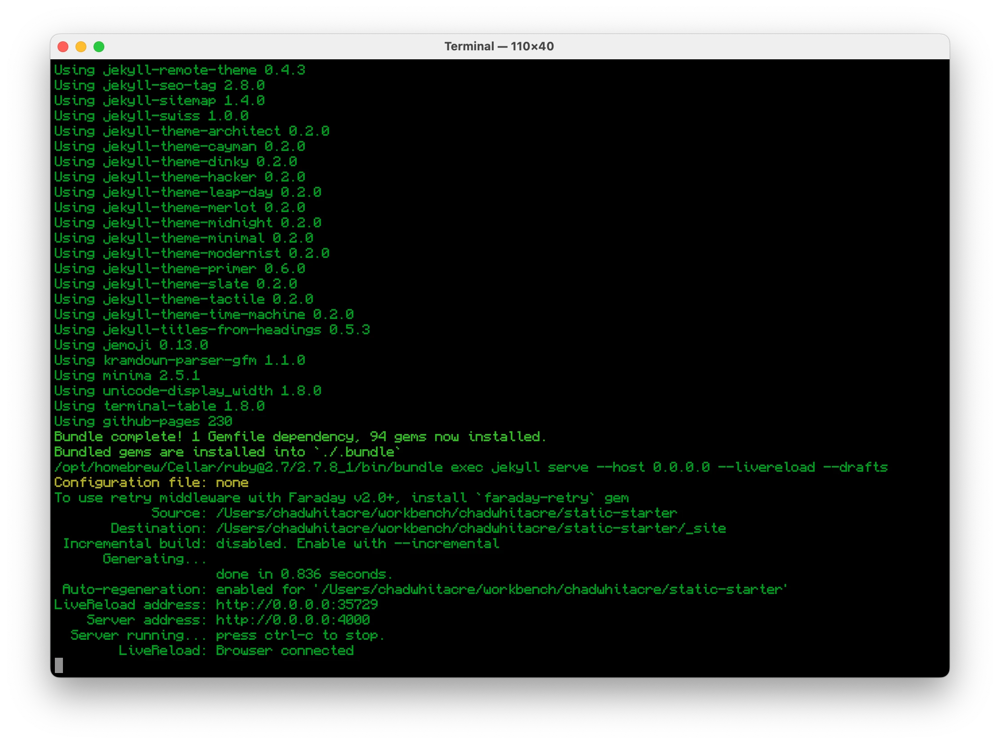

# Static Starter

This is a simple starter kit for static sites using [GitHub
Pages](https://pages.github.com/) with [Jekyll](https://jekyllrb.com/). It's a
really powerful combo, and it's free!

## Features

1. Designed for macOS since that's what you're on.
1. Matches locally the Ruby and gems [in GitHub Pages](https://pages.github.com/versions/).
1. Includes a sensible `.gitignore` (`TODO`, `_drafts/*`, etc.).
1. Tuned for dev, runs with `--livereload --drafts --future`.
1. Minimal dependencies you already have, Homebrew and Make.
1. Self-contained, shouldn't interfere with other Ruby installs on your machine.
1. Includes a basic `index.md` for when you're <i>really</i> eager to get your site up ASAP.

## Usage

[Fork](https://github.com/chadwhitacre/static-starter/fork), `git clone`, `make`, and [you're off](http://localhost:4000/)!

## Screenshot

